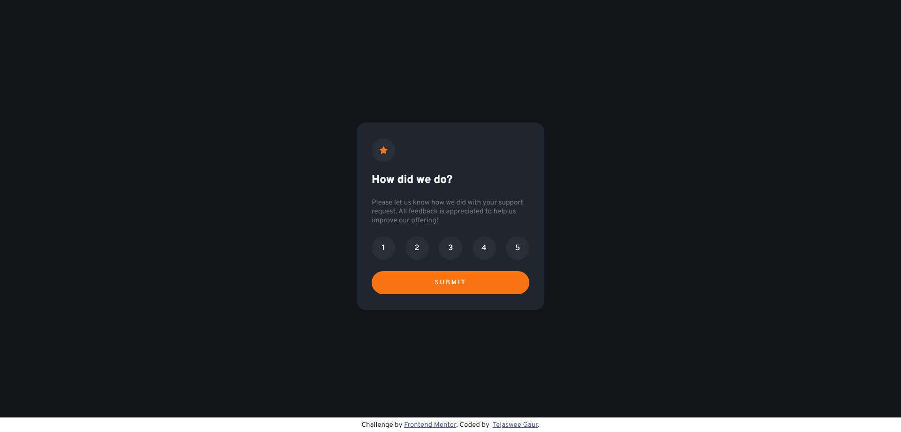
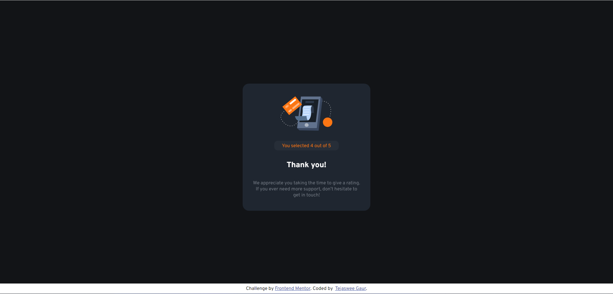
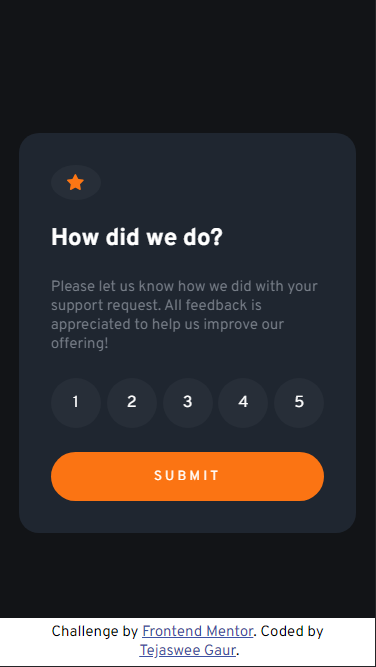
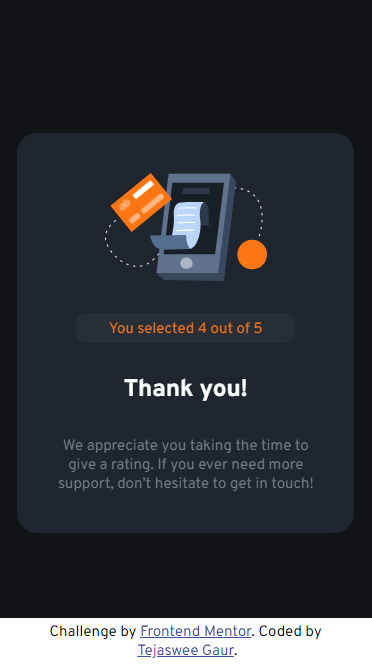

<!-- @format -->

# Frontend Mentor - Interactive rating component solution

This repository contains my solution to the [Interactive rating component challenge on Frontend Mentor](https://www.frontendmentor.io/challenges/interactive-rating-component-koxpeBUmI) by Frontend Mentor. The challenge is designed to help developers improve their coding skills by building realistic projects.

## Table of Contents

- [Overview](#overview)
  - [The Challenge](#the-challenge)
  - [Screenshot](#screenshot)
  - [Links](#links)
- [Features](#features)
- [My Approach](#my-approach)
- [Technologies Used](#technologies-used)
- [Getting Started](#getting-started)
- [Author](#author)
- [Acknowledgements](#acknowledgements)

## Overview

### The Challenge

The main goals of this challenge were:

- View the optimal layout for the app depending on their device's screen size
- See hover states for all interactive elements on the page
- Select and submit a number rating
- See the "Thank you" card state after submitting a rating

### Screenshot

### Links

- [Solution on GitHub](https://github.com/TejasweeGaur/interactive-rating-component-solution)
- [Live Site](https://tejasweegaur.github.io/interactive-rating-component-solution/)

## Features

- Responsive layout that adjusts to different screen sizes.
- Interactive elements with hover and focus states for improved user experience.

## My Approach

I approached this challenge by first analyzing the design and breaking it down into smaller components. I then used semantic HTML5 markup to structure the content and employed CSS custom properties for easy styling. Flexbox was my go-to choice for creating the responsive layout while ensuring optimal alignment and positioning of elements.
Used Javscript to add in the event listeners for effectively changing the seleced rating's score and keep track of the rating to display on the Thank You card.

## Technologies Used

- HTML5
- CSS3 (Flexbox and CSS Grid)
- Javascript

## Getting Started

To view the solution locally, you can follow these steps:

1. Clone the repository: `git clone https://github.com/TejasweeGaur/interactive-rating-component-solution.git`
2. Navigate to the project directory.
3. Open the `index.html` file in your browser.

## Author

- LinkedIn: [Tejaswee Gaur](https://www.linkedin.com/in/tejaswee-gaur/)
- Frontend Mentor: [@TejasweeGaur](https://www.frontendmentor.io/profile/TejasweeGaur)

## Acknowledgements

I would like to express my gratitude to Frontend Mentor for providing this challenge, which allowed me to enhance my coding skills and learn new techniques. Additionally, I want to thank the developer community for their support and insights during the development process. Your feedback is greatly appreciated!
